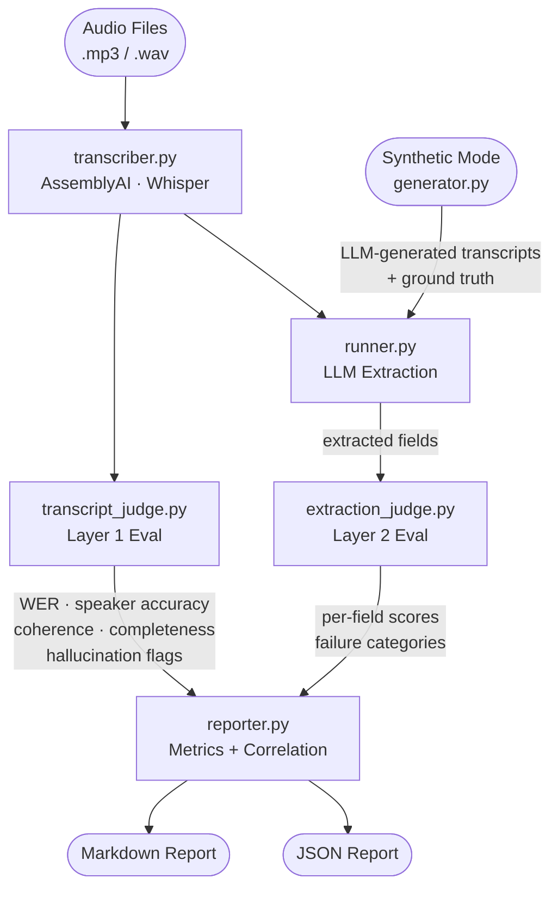
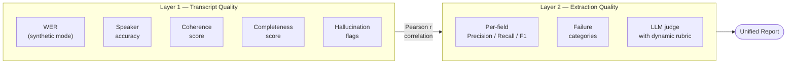

# llm-eval-agent

An autonomous agent that transcribes call audio, evaluates transcript quality, runs LLM extraction, and scores the results — producing a two-layer quality report with per-field metrics and a transcript↔extraction correlation signal.

Built for production teams who need to know not just *whether* an LLM extracts correctly, but *where* in the pipeline quality breaks down.

---

## Architecture

### Full pipeline



### Two-layer evaluation



### Module responsibilities

```
src/eval_agent/
├── schemas.py           Pydantic models for all data types
├── transcriber.py       Audio → structured transcript (AssemblyAI / Whisper)
├── transcript_judge.py  Layer 1: WER, speaker accuracy, LLM coherence judge
├── generator.py         Synthetic transcripts + ground truth via Claude
├── runner.py            Parallel LLM extraction (Anthropic + OpenAI)
├── extraction_judge.py  Layer 2: dynamic rubric + per-field LLM scoring
├── reporter.py          Metrics aggregation, correlation, markdown + JSON output
└── agent.py             CLI orchestrator (Typer)
```

---

## Quickstart

```bash
# 1. Install
git clone https://github.com/your-username/llm-eval-agent
cd llm-eval-agent
make install

# 2. Configure API keys
cp .env.example .env
# fill in ANTHROPIC_API_KEY, OPENAI_API_KEY, ASSEMBLYAI_API_KEY

# 3. Run on synthetic data (no audio files needed)
make eval-synthetic

# 4. Run on real audio files
make eval-audio AUDIO_DIR=path/to/calls/

# 5. Compare two models
make eval-compare MODEL=gpt-4o-mini COMPARE=gpt-4.1

# 6. Full end-to-end: generate synthetic → TTS → transcribe → eval
make eval-tts
```

---

## CLI reference

```bash
eval-agent run --task examples/extraction/task.yaml \
               --model gpt-4o-mini \
               --synthetic --n-cases 30

eval-agent run --task examples/extraction/task.yaml \
               --model gpt-4o-mini \
               --audio path/to/audio/ \
               --provider assemblyai

eval-agent run --task examples/extraction/task.yaml \
               --model gpt-4o-mini \
               --compare gpt-4.1 \
               --synthetic --n-cases 50
```

| Flag | Default | Description |
|------|---------|-------------|
| `--task` | required | Path to `task.yaml` |
| `--model` | `gpt-4o-mini` | Primary model to evaluate |
| `--compare` | — | Second model for side-by-side comparison |
| `--audio` | — | Directory of `.mp3`/`.wav` audio files |
| `--synthetic` | false | Generate synthetic test cases |
| `--n-cases` | 30 | Number of synthetic cases |
| `--tts` | false | Convert synthetic transcripts to audio via OpenAI TTS |
| `--provider` | `assemblyai` | Transcription provider (`assemblyai` or `whisper`) |
| `--workers` | 10 | Parallel extraction threads |
| `--output` | `results/` | Output directory |

---

## Task spec format

Define your extraction task in YAML:

```yaml
name: sales_call_extraction
description: Extract decision signals from advisor call transcripts.

fields:
  - name: urgency
    type: enum
    values: [high, medium, low]
    description: How urgently the customer needs placement
    nullable: true

  - name: budget_mentioned
    type: bool
    description: Whether a specific budget was explicitly stated
    nullable: false

constraints:
  - Return null for fields with insufficient evidence — do not infer
  - budget_mentioned must be false unless a dollar amount was explicitly stated
```

See [`examples/extraction/task.yaml`](examples/extraction/task.yaml) for a full example.

---

## Example report output

```
# Eval Report — sales_call_extraction
**Model:** `gpt-4o-mini`  |  **Transcripts evaluated:** 30

## Layer 1: Transcript Quality

| Metric            | Score  |
|-------------------|--------|
| WER               | 4.2%   |
| Speaker accuracy  | 91.3%  |
| Coherence         | 0.87   |
| Completeness      | 0.93   |
| Overall quality   | **0.91** |

## Layer 2: Extraction Quality

| Field            | Precision | Recall | F1      |
|------------------|-----------|--------|---------|
| urgency          | 0.880     | 0.820  | **0.849** |
| budget_mentioned | 0.940     | 0.910  | **0.925** |
| objection_type   | 0.710     | 0.680  | **0.695** |
| sentiment        | 0.900     | 0.880  | **0.889** |

**Overall F1:** 0.839

## Failure Patterns

- hallucination: 4/30 cases (13%)
- wrong_value: 3/30 cases (10%)

## Transcript Quality → Extraction Quality Correlation

Pearson r = **0.612**

> Calls with lower transcript quality scores tend to show proportionally lower extraction F1.
```

---

## Agentic design decisions

**Coverage-aware test case generation** — the generator tracks category distribution across `happy_path`, `edge_case`, `adversarial`, and `boundary` cases and generates targeted batches to fill gaps until the target distribution is reached.

**Dynamic rubric** — the extraction judge generates a task-specific scoring rubric from the task description before evaluating. Different tasks produce different rubrics automatically — no hardcoded rules.

**Two-layer correlation** — the reporter computes Pearson correlation between transcript quality scores and extraction scores across the same calls. This distinguishes transcription failures from prompt/model failures, which matters when deciding where to invest optimization effort.

---

## Development

```bash
make lint          # ruff
make typecheck     # mypy
make test-unit     # offline unit tests (no API calls)
make test-regression   # golden fixture regression tests
make update-golden     # update golden fixtures after intentional changes
```

CI runs on every PR. The `eval.yml` workflow can be triggered manually or on release to run a full synthetic eval and post results as a PR comment.

---

## Motivation

This project distills patterns from building production LLM extraction pipelines: structured signal extraction from thousands of call transcripts, per-signal precision/recall tracking, LLM judges for quality monitoring, and comparative model evaluations. The open-source version makes these patterns portable to any extraction task via a simple YAML spec.
